# 손바닥 sEMG 사용자 식별

### 작은 데이터에서 성능과 재현성을 확인하고 단일 모델을 선택한 실험 기록

문손잡이를 돌리는 **3초 동안의 손바닥 sEMG로 등록된 5명 A–E 중 누구인지 구분**한다. 수업의 DenseNet161·ResNet18·SimpleCNN 비교에서 시작해, 전처리·학습 레시피·수작업 특징·확률 보정·앙상블을 단계적으로 검토했다. 이 README가 현재의 종합 보고서이며, 필수 비교·SVM의 표와 그림은 기존 공개 예측·학습 기록에서, 추가 실험은 검토된 집계표에서 생성했다.

**최종 제출 구성은 39특징 보정 RBF SVM 단독이다. 기존 시험 50시행의 950창 중 887개 정답, Accuracy 93.37%, macro F1 93.40%다.** 같은 저장 평가에서 정확도가 가장 높은 구성은 50:50 hybrid의 94.63%다. SVM 선택은 최고 정확도 주장보다 단일 모델의 구성과 처리 비용까지 고려한 결정이며, 그 차이와 포기한 성능을 [8절](#selection)에 함께 제시한다.

| 먼저 알아야 할 것 | 현재 결론 |
|---|---|
| 무엇을 분류했나 | 등록 사용자 5명의 closed-set 식별. 미등록자 거절이나 보안 인증 성공률은 평가하지 않음 |
| 최종 수치의 단위 | 300 ms 창. 같은 3초 시행에서 나온 19개 창은 서로 겹침 |
| 시험집합의 상태 | 이전 실험에서 이미 확인한 **재사용 holdout**. 새 독립시험의 일반화 성능으로 주장하지 않음 |
| 수업 필수 비교 | DenseNet161 + ResNet18 + SimpleCNN, 각 45epoch × 3seed 및 DenseNet 개발 5-fold 보존 |
| 이번 정리에서 실행한 것 | 저장 예측 재검산, 기존 공개 예측 재검산, 추가 실험 집계표 확인, 표·그림·문서 생성과 테스트. 새로운 학습·튜닝은 실행하지 않음 |
| 빠른 확인 | `cd sEMG_final && python svm_final/audit.py` |

[4쪽 과제 요약 PDF](sEMG_final/results45/summary/report.pdf) · [최종 제출 선택 기록](sEMG_final/final_selection.json) · [기준선 집계](sEMG_final/results45/summary/summary.json) · [SVM 집계](sEMG_final/svm_final/evidence/final_metrics.json) · [추가 실험 설명과 집계](#experiments) · [재현·외부·중단 실험](#robustness)

## 읽는 순서

1. [문제와 평가 기준](#question)
2. [데이터 품질과 누수 없는 분할](#data)
3. [전처리와 모델 설계](#methods)
4. [필수 딥러닝 비교와 학습 진단](#baseline)
5. [가설에서 후보 선택까지](#experiments)
6. [고정된 최종 평가와 공정한 비교](#final-results)
7. [누구를 언제 틀리는가](#errors)
8. [정확도와 비용을 함께 본 최종 선택](#selection)
9. [재현·외부 데이터·실패한 가설](#robustness)
10. [재현 방법과 근거 파일 지도](#reproduce)
11. [한계와 다음 검증](#limits)
12. [출처와 이전 제출 자료](#references)

<a id="question"></a>
## 1. 문제와 평가 기준

### 1.1 무엇을 검증하려 했는가

입력은 두 채널의 표면근전도이고 출력은 A–E의 다섯 클래스다. 짧은 창에서도 사용자 고유의 패턴이 남는지, 큰 CNN이 이 작은 데이터에 적합한지, 표현 방식과 학습 과정의 변화가 성능·안정성·비용에 어떤 영향을 주는지 확인한다.

핵심 질문은 세 가지다.

- **기준선:** 같은 분할·학습 예산에서 DenseNet161과 두 베이스라인은 어떻게 다른가?
- **개선의 근거:** 정규화·필터·학습 레시피·특징 결합을 바꾼 결과를, 실제로 바꾼 요소의 범위 안에서 설명할 수 있는가?
- **선택:** 정확도 차이, seed 변동, 오류 유형, 계산 비용과 적용 한계를 함께 볼 때 어떤 구성이 적절한가?

### 1.2 지표와 비교 단위

- **Accuracy:** 맞힌 창 / 전체 창.
- **Precision·Recall·F1:** A–E별 값을 구한 뒤 동등하게 평균한 macro 지표. 클래스가 균형인 950창 시험에서는 macro Recall과 Accuracy가 같다.
- **seed 평균:** 같은 시행 분할에서 초기화·셔플을 바꾼 학습 반복의 평균이다. 새로운 피험자나 새로운 시험집합이 아니다.
- **개발 CV:** 개발 시행을 fold로 나눈 값이다. 후보 선택 뒤 수행한 CV는 선택 과정 전체를 검증하는 nested CV가 아니다.
- **시행 집계:** 19개 창의 확률을 평균한 3초 시행 단위 지표다. 300 ms 창 정확도와 구분한다.

본문의 **평균 ± SD는 별도 표시가 없으면 모집단 SD(ddof=0)**다. GPU 확장 실험은 원기록의 표본 SD(ddof=1)를 명시해서 사용한다. 두 SD와 신뢰구간을 같은 의미로 읽지 않는다.

### 1.3 요구 항목이 어디에 있는가

| 요구 항목 | 이 보고서 | 검증 가능한 구현·기록 |
|---|---|---|
| 문제 정의·데이터·방법 | 1–3절 | [분할·중복 검사](sEMG_final/data_utils.py), [공통 학습·CWT](sEMG_final/experiment.py) |
| DenseNet + 두 베이스라인, 네 지표 | 4절 | [고정 계획](sEMG_final/results45/frozen_plan.json), [22개 평가 재검산](sEMG_final/summarize45.py) |
| 모델별 혼동행렬·최대 오류·분석 | 7절 | [클래스·창별 표](sEMG_final/results45/summary/), [저장 예측](sEMG_final/results45/evaluation/) |
| 5-fold 값과 평균 ± SD | 4.4절, 5.4절 | [원본 DenseNet CV](sEMG_final/results45/summary/cross_validation.csv), [SVM CV 기록](sEMG_final/svm_final/evidence/completion.json) |
| 시간·파라미터·최종 결과 | 6–8절 | [CPU 처리 비용 집계](#selection) |
| 세 가지 이상의 한계 | 11절 | 재사용 시험·선택 편향·세션·비인과 처리·실행 환경 차이 명시 |
| 실행 환경·seed·재현·AI 사용 | 10–12절 | [SVM 검증 코드](sEMG_final/svm_final/audit.py), [기준선 검증 코드](sEMG_final/test_summary45.py), [AI 사용 공개](#references) |

<a id="data"></a>
## 2. 데이터 품질과 누수 없는 분할

### 2.1 데이터 확인

원자료는 [palm-sEMG-doorknob-filtered](https://github.com/sea3551/palm-sEMG-doorknob-filtered)의 commit `adb7955f4416165c88e4111af6f8fdafd416209c`다. CSV 250개, 피험자당 50시행, 파일당 3,000행 × 2채널, 표본율 1,000 Hz다. 한 시행의 길이는 3초이며 파지·회전·정지 구간으로 구성된다.

| 확인 항목 | 결과 | 근거 |
|---|---|---|
| 파일 수·모양·유한값 | 250개, 모두 (3000, 2), NaN·무한대 없음 | [초기 데이터 검사](submission/analysis.json), [파일별 manifest](submission/data_manifest.csv) |
| 완전히 같은 신호 | E의 38번과 50번이 동일 | [중복 검사 기록](submission/analysis.json) |
| 학습에 사용한 고유 시행 | E50을 제외한 249시행 | [249시행 manifest](sEMG_final/results45/manifest.csv) |
| 원자료 수정 여부 | 파일을 수정하지 않고 분할 대상에서 중복 한 개만 제외 | [데이터 로더](sEMG_final/data_utils.py) |
| 원자료 공개 방식 | 이 저장소에는 원시 신호를 추가하지 않음. 재학습할 때 고정 원출처를 받음 | [재현 절차](#reproduce) |

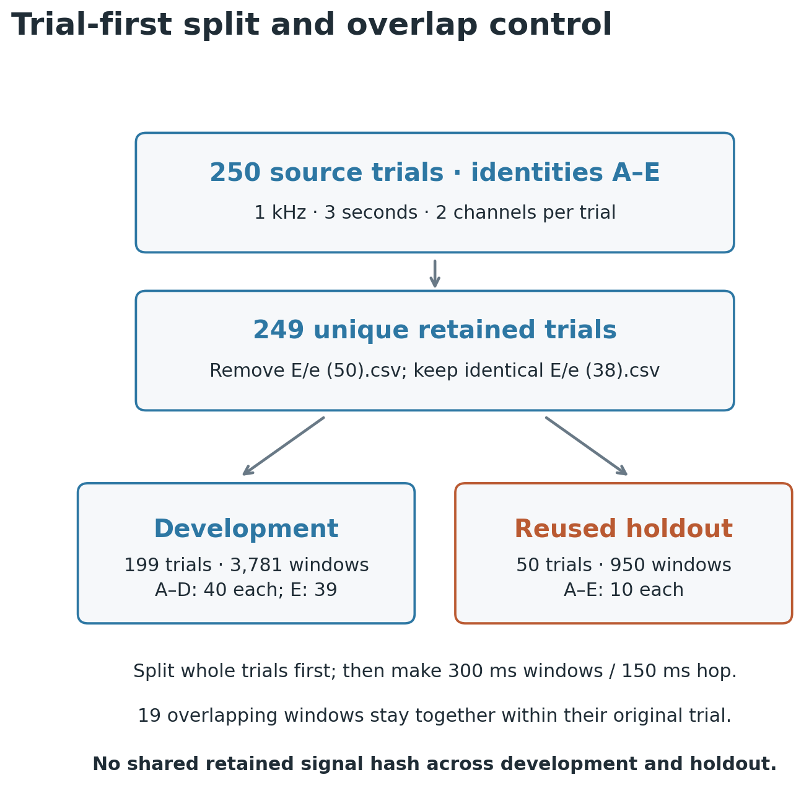

**그림 1.** 분할 단위는 창이 아니라 원본 시행이다. 같은 시행의 이웃 창이 학습·평가에 함께 들어가는 것을 막는다. 중복 제거와 시행 분할이 세션 독립성까지 보장하는 것은 아니다.

### 2.2 분할을 먼저 하고 창을 만든 이유

길이 300샘플, hop 150샘플이면 `(3000−300)/150+1 = 19`개 창이 생긴다. 인접 창은 150샘플을 공유하므로 창을 먼저 섞어 나누면 거의 같은 신호가 양쪽에 들어갈 수 있다. 먼저 피험자 비율을 유지하며 시행을 나누고, 각 시행 안에서만 창을 생성했다.

| 범위 | 시행 수 | 창 수 | 용도 |
|---|---:|---:|---|
| 전체 개발집합 | 199 | 3,781 | 고정 최종 학습 및 개발 5-fold |
| 개발 내부 학습 | 159 | 3,021 | 개선 후보 탐색·학습 |
| 개발 내부 검증 | 40 | 760 | 후보·epoch·보정·hybrid 선택 |
| 재사용 시험 | 50 | 950 | 고정 후보의 최종 결과 기록 |

시험은 A–E 각 10시행·190창이다. 개발집합은 A–D 각 40시행, E 39시행이다. 모든 모델이 같은 역할의 비교에서 같은 인덱스를 쓰며, 예측 파일도 `(시행 경로, 창 번호, 정답)`이 계획과 일치하는지 검사한다. 근거는 [공통 분할](sEMG_final/results45/splits.json), [SVM 분할](sEMG_final/svm_final/evidence/splits.json), [예측 무결성 검사](sEMG_final/test_summary45.py)다.

**시험집합은 처음부터 완전히 잠겨 있던 집합이 아니다.** 초기 5epoch 과제에서 이미 결과를 확인했고 이후에도 재사용했다. 최종 설정을 평가 전에 고정했더라도 과거 관찰을 지울 수 없으므로, 본문의 최종 점수는 탐색적 재사용 시험 결과로 해석한다.

### 2.3 대표 파형을 어떻게 읽었는가

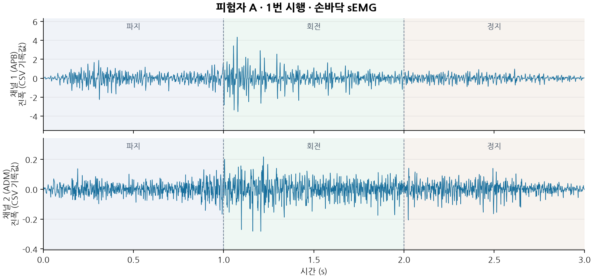

**그림 2.** 사전에 파일 번호로 선택한 A의 1번 시행이다. 모든 사람의 일반적인 패턴을 대표한다고 보지 않는다. 초기 관찰에서 A와 D는 RMS가 가장 큰 동작 구간이 달랐고 두 채널의 진폭 비도 달랐다. 이 관찰은 이후 진폭·모양 특징을 나누어 검토한 동기이며, 사용자 식별의 원인을 입증한 결과는 아니다. [대표 시행별 관찰과 RMS](submission/analysis.json), [나머지 대표 파형](submission/images/)에 원기록이 있다.

<a id="methods"></a>
## 3. 전처리와 모델 설계

### 3.1 같은 신호를 두 방식으로 표현했다

| 단계 | 수업 CNN 기준선 | 최종 SVM |
|---|---|---|
| 필터 | 제공본 위에 60 Hz notch Q=30, 4차 20–499 Hz band-pass 추가 | 같은 추가 필터 |
| 창 | 300 ms, hop 150 ms | 같음 |
| 창 정규화 | 두 채널 전체 min–max | 채널별 평균 제거, 절대 진폭 정보 일부 보존 |
| 표현 | Morlet CWT scale 1–32, 두 채널 절댓값 + 평균 | 진폭 4 + 모양·스펙트럼 35 = 39특징 |
| 입력 크기 | 3 × 32 × 300 | 39 |
| 학습된 전처리 | 창별 변환, 별도 전역 scaler 없음 | 각 학습 부분에서만 StandardScaler 적합 |
| 분류기 | SimpleCNN / ResNet18 / DenseNet161 | RBF SVC, C=1, gamma=`scale` |
| 확률 | softmax | 시행 단위 3-fold OOF sigmoid 보정 |

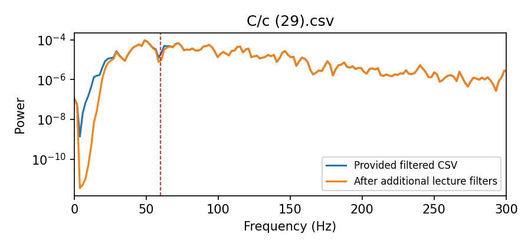
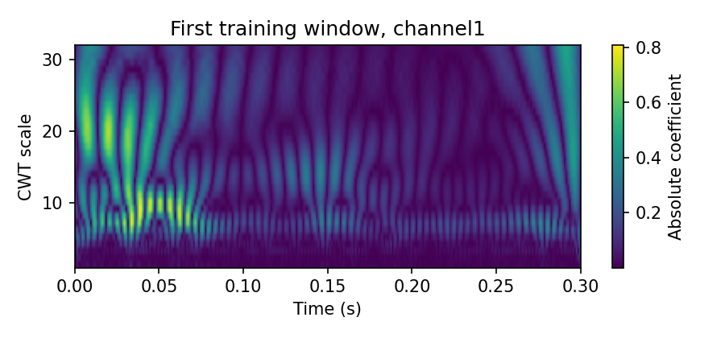

**그림 3–4.** 고정된 학습 시행에서 만든 예시다. 제공 데이터는 이미 필터링되어 있는데 수업 구현에서는 필터를 추가했다. 이 선택을 숨기지 않고, 추가 탐색에 제공 필터만 쓰는 대조 후보도 포함했다. CWT 입력의 세로축은 스케일이므로 일반 이미지의 회전·좌우 반전과 같은 의미로 취급하지 않았다.

### 3.2 딥러닝 기준선의 구조와 공통 예산

- **SimpleCNN:** 두 합성곱 3→32→64와 평균 pooling, 19,717개 파라미터.
- **ResNet18:** 잔차 연결, 최종 512→5 분류기, 11,179,077개 파라미터.
- **DenseNet161:** 조밀 연결, 최종 2208→5 분류기, 26,483,045개 파라미터.
- 세 모델 모두 사전학습 없음, Adam lr=0.001, batch 16, Cross-Entropy, **45epoch 마지막 가중치**, 학습 seed 42/43/44다. 분할 seed는 42로 고정했다.

DenseNet은 torchvision 기본 7×7 stride-2 첫 합성곱을 쓰고 별도 dropout을 넣지 않았다. 논문의 미공개 분할·dropout 세부까지 일치하는 정밀 재현이라고 주장하지 않는다. [실제 구현](sEMG_final/experiment.py)과 [변경 불가능한 당시 계획](sEMG_final/results45/frozen_plan.json)을 함께 남겼다.

### 3.3 SVM의 39특징과 보정

진폭 특징은 채널별 log RMS·log MAV의 네 값이다. 모양 특징은 상대 대역전력 여섯 개, 평균·중앙 주파수, 스펙트럼 엔트로피, waveform length, MAV/RMS, 왜도·첨도, zero crossing, slope-sign change, lag 1/2 값과 채널 간 상관으로 구성한다. 정확한 정의와 배열 순서는 [features.py](sEMG_final/svm_final/features.py)가 기준이다.

`StandardScaler → RBF SVC`를 한 pipeline으로 두어 보정 fold의 학습 부분에서만 scaler가 학습되게 했다. Sigmoid 보정은 seed 2026의 **시행 단위 3-fold** OOF 점수를 쓰며 `ensemble=False`다. 보정 후에는 개발 199시행 전체에 적합한 단일 base SVC가 남는다. 최종 모델의 기록은 1,440 support vectors, 642,444 bytes다. 신경망 파라미터 수와 support vector 수는 서로 다른 복잡도 지표이므로 같은 열의 동등한 단위로 비교하지 않는다.

[고정 SVM 코드와 재현 안내](sEMG_final/svm_final/README.md) · [모델·보정 구현](sEMG_final/svm_final/model.py) · [원래 실행 코드와 출처 해시](sEMG_final/svm_final/evidence/provenance.json)

<a id="baseline"></a>
## 4. 필수 딥러닝 비교와 학습 진단

### 4.1 네 지표와 seed 변동

같은 재사용 시험 950창에서 얻은 **세 seed 평균 ± 모집단 SD, 단위 %**다. Precision·Recall·F1은 macro다. 이 표가 수업의 공통 45epoch 비교이며, 뒤의 검증 선택형 레시피와 별도로 유지한다.

| 모델 | Accuracy | Precision | Recall | F1 |
| --- | --- | --- | --- | --- |
| SimpleCNN | 62.63 ± 0.39 | 62.70 ± 0.56 | 62.63 ± 0.39 | 62.08 ± 0.45 |
| ResNet18 | 88.04 ± 0.65 | 88.20 ± 0.68 | 88.04 ± 0.65 | 87.99 ± 0.64 |
| DenseNet161 | 88.53 ± 0.39 | 88.92 ± 0.49 | 88.53 ± 0.39 | 88.55 ± 0.44 |
| DenseNet161+BN | 88.95 ± 0.91 | 89.31 ± 0.91 | 88.95 ± 0.91 | 88.90 ± 0.87 |

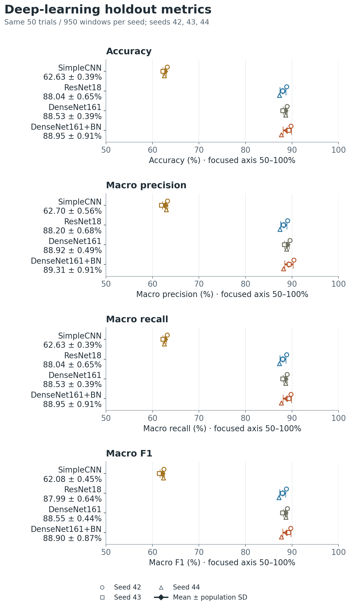

**그림 5.** 평균만 보지 않고 개별 seed도 함께 표시했다. DenseNet161+BN의 평균 Accuracy 88.95%가 비교군 중 가장 높고 SimpleCNN 62.63%가 가장 낮다. 다만 DenseNet 원본의 88.53% ± 0.39 pp와 BN의 88.95% ± 0.91 pp를 보면, 평균 차이는 약 0.42 pp이고 BN의 seed 변동이 더 크다. 작은 평균 차이만으로 안정적인 개선이라고 결론내리지 않는다.

근거: [22개 평가 요약](sEMG_final/results45/summary/summary.json), [개별 실행 표](sEMG_final/results45/summary/all_evaluations.csv), [그림에 사용한 표](sEMG_final/results45/summary/).

### 4.2 학습 곡선이 보여 주는 것과 보여 주지 않는 것

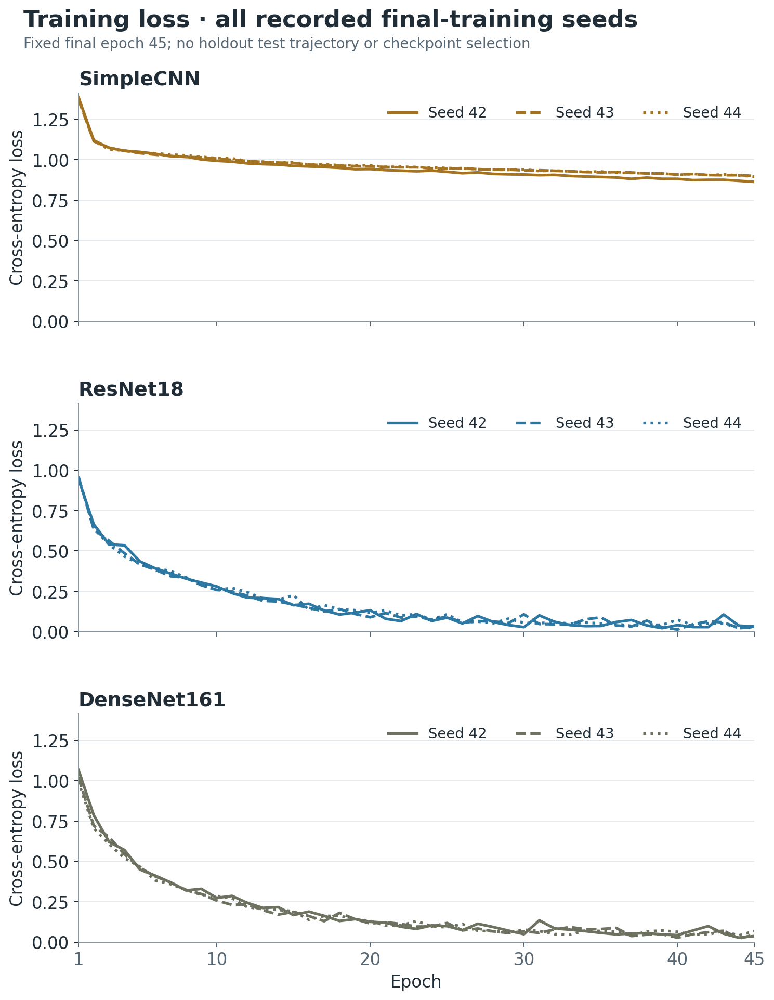

**그림 6.** 저장된 holdout 학습 로그의 곡선이다. 로그에는 학습 손실과 online train accuracy만 있으며, 없던 검증·시험 곡선을 만들지 않았다. 시험 점수를 epoch 선택에 사용한 곡선도 아니다.

SimpleCNN의 마지막 online train accuracy는 seed별 약 63.26–64.59%이고 시험 평균도 62.63%다. 반면 ResNet18은 online train accuracy 약 98.89–99.29%인데 시험 평균 88.04%, DenseNet161은 약 97.57–98.70%인데 시험 평균 88.53%다. 따라서 SimpleCNN은 현재 설정에서 학습 자체의 적합이 제한되고, 큰 모델은 학습과 시험 사이의 차이가 남는다. 모델 용량·최적화·표현 손실 중 무엇이 원인인지는 이 곡선만으로 확정할 수 없다. Online train accuracy는 학습 도중 배치별로 계산한 값이므로 최종 고정 가중치의 학습집합 재평가와도 구분한다.

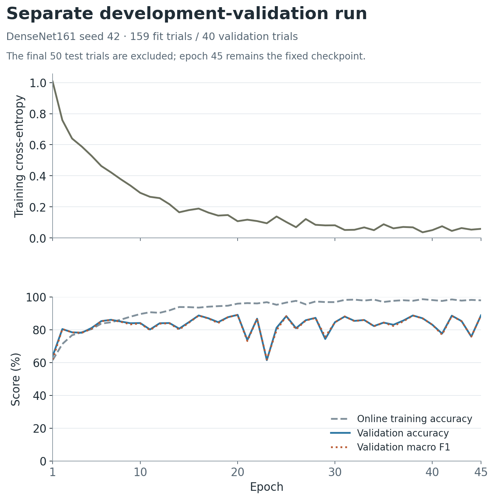

**그림 7.** 별도 개발 159/40 시행의 검증 기록이다. 앞의 199/50 시험 비교와 다른 역할의 데이터다. 이 구분 덕분에 최종 시험 곡선을 보지 않고도 후보 선택의 과정을 설명할 수 있다.

### 4.3 BN 재보정은 얼마나 도움 되었는가

DenseNet161+BN은 가중치 학습을 다시 하는 모델이 아니다. 학습 창만 한 번 통과시켜 BatchNorm 통계를 재계산했다(batch 16, 셔플 seed 2026). 당시 개발 검증은 88.82→89.08%, 즉 **760창 중 순증 두 개**였다. 작은 차이라 원본과 변형을 모두 보고했다.

시험 seed 42에서 B→E는 13→6개로 줄지만 E→B는 29→33개로 늘었다. 평균 개선과 개별 클래스 개선은 같은 말이 아니다. 이런 상쇄를 [7절](#errors)의 혼동행렬에서 확인할 수 있다. 근거는 [개발 원본·재보정 예측](sEMG_final/results45/development/), [BN 코드](sEMG_final/bn_recalibrate.py)다.

### 4.4 DenseNet 개발 5-fold

시험 50시행을 제외한 개발 199시행 내부에서 각 fold를 새로 45epoch 학습했다. 학습 seed는 43–47이다. 아래 값은 윈도우 지표 %, SD는 모집단 기준이다.

| Fold | 검증 시행 | DenseNet Accuracy | DenseNet+BN Accuracy | DenseNet F1 | DenseNet+BN F1 |
| --- | --- | --- | --- | --- | --- |
| 1 | 40 | 76.18 | 84.34 | 76.41 | 84.39 |
| 2 | 40 | 77.89 | 85.39 | 77.97 | 85.47 |
| 3 | 40 | 85.79 | 86.18 | 85.72 | 86.17 |
| 4 | 40 | 81.05 | 85.53 | 81.22 | 85.56 |
| 5 | 39 | 85.43 | 86.64 | 84.94 | 85.98 |
| 평균 ± 모집단 SD | 199 전체 | 81.27 ± 3.87 | 85.62 ± 0.78 | 81.25 ± 3.68 | 85.51 ± 0.62 |

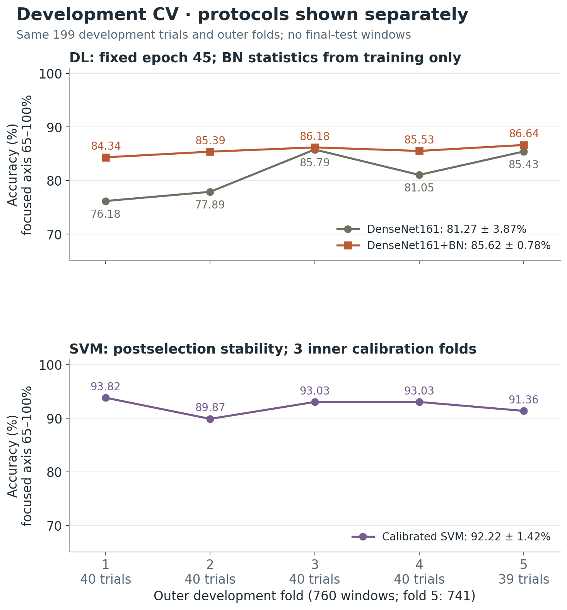

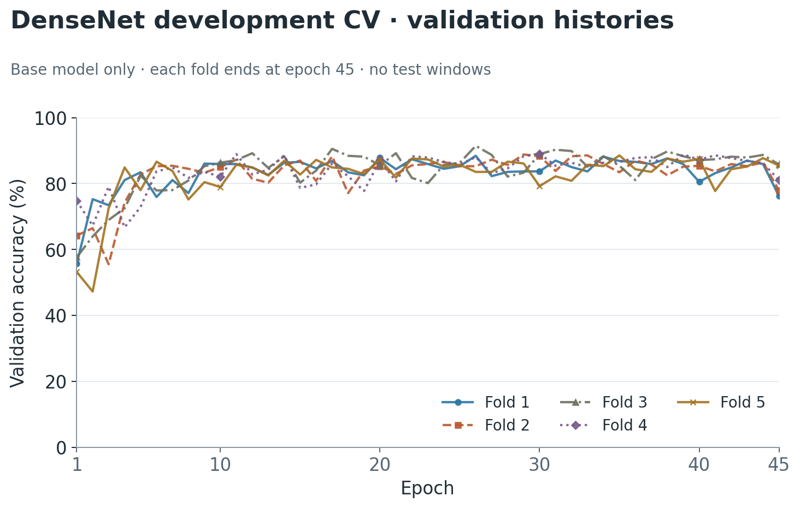

각 fold의 검증 이력을 함께 제시한다. 최종 시험집합의 epoch별 곡선이 아니며, 기록된 개발 CV 과정에 한정된다.

**그림 8.** 원본 DenseNet, BN 변형과 SVM 개발 CV를 표시하되 해석 범위를 나눴다. 원본·BN은 같은 학습의 후처리 대조이고 SVM은 특징·분류기·선택 이력이 다르다. 모든 점이 개발집합 안의 결과라는 사실을 유지한다. DenseNet의 개발 CV에서는 BN이 평균 81.27→85.62%(+4.35 pp), SD 3.87→0.78 pp로 변했다. 시험의 평균 +0.42 pp와 크기가 다르므로, 분할·학습량에 따라 BN의 효과가 달라졌다는 관측이지 모든 상황의 보편적 교정이라고 볼 수 없다.

논문 DenseNet의 test 94.00%와 본 실험의 45epoch 평균 88.53%는 5.47 pp 차이가 나지만, 이 차이를 한 가지 구현 요소의 탓으로 돌릴 수 없다. 중복 처리, 시행 분할, 추가 필터, CWT, 모델 세부와 시험 사용 이력이 다르다.

<a id="experiments"></a>
## 5. 가설에서 후보 선택까지

<a id="additional-evidence"></a>
추가 실험은 이 README 안의 집계표와 그래프로 제시한다. 추가 실험의 개별 시행 예측·상세 메타데이터는 이 공개본에 포함하지 않아 원자료 수준의 독립 재검산을 지원하지 않는다. 기존 필수 비교와 최종 SVM의 공개 예측·재현 코드는 그대로 사용할 수 있다.

### 5.1 실험을 진행한 순서

| 단계와 실행 묶음 | 질문 | 선택에 사용한 범위 | 완료 상태와 근거 |
|---|---|---|---|
| `holdout_*_seed42/43/44` + `cv_DenseNet161_fold1–5` | 같은 예산의 세 CNN은 어떻게 다른가 | 고정 45epoch, 당시 계획에 따른 평가 | [기준선 실행](sEMG_final/results45/runs/), 14회 학습·22개 평가 |
| `validate_<recipe>_seed42` | 필터·정규화·학습법·작은 구조 중 유망한 방향은 무엇인가 | 개발 159/40, 8개 레시피 | [8개 screening 표](#additional-evidence) |
| `validate_*_seed43/44` | 첫 seed의 순위가 유지되는가 | 기준선과 상위 두 후보를 세 seed로 확인 | [반복 선택 표](#additional-evidence) |
| 18개 classical recipe | 진폭·모양·결합 특징 중 무엇이 유용한가 | 159 학습 시행 내부 grouped 3-fold로 선택, 40 검증 시행으로 확인 | [탐색 범위와 선택 기준](#experiments) |
| 고정 calibrated SVM | 확률 보정이 결정·결합에 어떤 영향을 주는가 | 학습 내부 grouped OOF 보정 | [사전 보정 계획](sEMG_final/svm_final/evidence/fixed_calibration_plan.json) |
| DenseNet·SVM 개발 5-fold | 선택된 레시피의 분할별 안정성은 어떤가 | 개발 199시행 내부, 선택 후 점검 | [CPU CV](#additional-evidence), [SVM CV](sEMG_final/svm_final/evidence/completion.json) |
| 고정 최종 평가·50:50 hybrid | 모든 후보를 같은 950창에서 비교하면 어떤가 | 새 설정과 혼합 비중을 동결한 뒤 재사용 시험 | [고정 평가의 집계](#final-results) |
| GPU·외부 날짜·후속 대조 | 재현과 일반화의 한계는 무엇인가 | 별도 프로토콜 | [9절](#robustness) |

추가 실험의 모델·seed·epoch별 집계는 [CPU 실험 집계표](#additional-evidence)에 정리했다. 개별 시행 예측·상세 분할은 이번 공개본에 포함하지 않는다. 화면에서 보기 좋은 실행만 골라 넣지 않고, 완료된 비교의 불리한 결과도 함께 남긴다.

### 5.2 딥러닝 후보 8개

| 가설 | 바꾼 요소 | 해석 가능한 범위 |
|---|---|---|
| 일정 학습률보다 스케줄이 유리할 수 있다 | AdamW·weight decay·cosine을 한 묶음으로 변경 | 묶음 레시피 효과. 개별 요소의 기여도는 분리할 수 없음 |
| 정규화가 일반화를 도울 수 있다 | dropout·label smoothing 추가 | 함께 바뀐 구성의 비교 |
| CWT의 DC/offset 처리가 중요할 수 있다 | centered CWT 후보 | 같은 계열의 centered/uncentered 대조를 먼저 확인 |
| 중복 필터가 불필요할 수 있다 | `lecture`와 `provided` 필터 비교 | 해당 레시피·분할에서의 필터 대조 |
| 작은 모델도 충분할 수 있다 | TFCompact, 359,405개 파라미터 | 구조와 정규화 설정이 함께 달라지는 비교임을 명시 |

모든 후보의 checkpoint 선택 규칙은 검증 Accuracy 최대 → 검증 unsmoothed CE 최소 → 가장 이른 epoch다. 상한은 45epoch이며 고정 45epoch 값도 별도로 보존했다. 다음은 seed 42, 검증 760창의 Accuracy %다.

| 레시피 | 선택 epoch | 선택 raw Accuracy | +BN Accuracy | 고정 45epoch Accuracy |
| --- | --- | --- | --- | --- |
| baseline | 17 | 88.55 | 87.76 | 87.11 |
| compact_centered | 35 | 91.05 | 91.05 | 90.53 |
| compact_regularized | 37 | 90.66 | 90.53 | 90.26 |
| dense_centered | 23 | 90.79 | 90.66 | 89.21 |
| dense_cosine | 44 | 89.61 | 89.61 | 88.95 |
| dense_provided | 30 | 89.87 | 90.00 | 88.82 |
| dense_regularized | 31 | 88.42 | 88.42 | 86.97 |
| resnet_regularized | 26 | 89.87 | 90.13 | 88.55 |

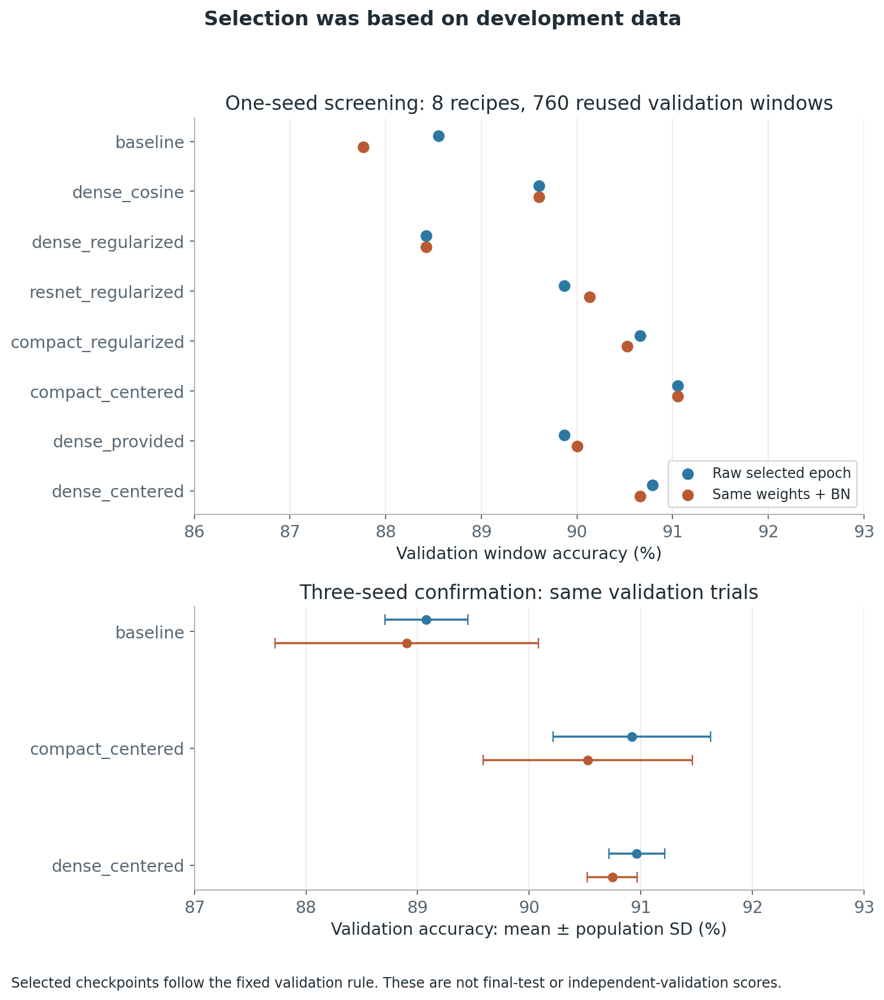

**그림 9.** 한 번의 screening과 세 seed 확인을 분리했다. 첫 seed에서 `compact_centered`가 높았지만 반복 후 raw 평균은 `dense_centered` 90.96%, `compact_centered` 90.92%였다. 차이는 약 0.04 pp로 매우 작다. 선택 규칙에 따라 DenseNet 후보를 택했지만 구조의 확실한 우위를 입증한 것은 아니다.

| 레시피 / 변형 | Accuracy 평균 ± SD | macro F1 평균 ± SD | 선택 epoch 42/43/44 |
| --- | --- | --- | --- |
| baseline / base | 89.08 ± 0.37 | 88.93 ± 0.46 | [17,45,18] |
| baseline / bn | 88.90 ± 1.18 | 88.83 ± 1.22 | [17,45,18] |
| compact_centered / base | 90.92 ± 0.70 | 90.89 ± 0.69 | [35,33,28] |
| compact_centered / bn | 90.53 ± 0.94 | 90.49 ± 0.93 | [35,33,28] |
| dense_centered / base | 90.96 ± 0.25 | 90.91 ± 0.25 | [23,44,40] |
| dense_centered / bn | 90.75 ± 0.22 | 90.71 ± 0.21 | [23,44,40] |

최종 개선 DL 레시피는 `dense_centered`, raw 가중치, **40epoch**로 고정했다. 40은 선택 epoch [23, 44, 40]의 중앙값이다. 이후 5-fold의 raw 평균 Accuracy는 90.48%, BN 변형은 89.92%였다. 이 값으로 뒤늦게 변형을 바꾸지 않았다.

Centered CWT는 joint-channel min–max 뒤 채널별 평균을 제거하고 CWT를 계산한다. 세 번째 채널은 두 절댓값 CWT 맵의 평균이다.

**분리해서 말할 수 있는 결과:** compact 계열의 centering 대조와 dense 계열의 필터 대조는 해당 설정 안에서 한 전처리 요소를 바꾼다. 반면 모델 구조·optimizer·regularization이 함께 다른 후보의 점수 차이를 ‘구조가 만든 이득’으로 계산하지 않는다. [레시피 변경 범위](#experiments), [검증 집계](#experiments)에 설정과 결과가 있다.

### 5.3 진폭과 모양 특징은 함께 있을 때 유용했는가

세 feature family × 두 classifier × 세 C값, 총 18개 조합을 **159 학습 시행 내부의 grouped 3-fold**에서 비교했다. Family별 선택된 세 모델만 40 검증 시행에 적용했다. 따라서 다음 행 사이에서는 특징뿐 아니라 선택된 classifier/C도 달라질 수 있으며, 순수한 feature ablation이라고 부르지 않는다.

| 특징 / 보정 | 선택 classifier | C | 정답 / 창 | Accuracy | Precision | Recall | F1 |
| --- | --- | --- | --- | --- | --- | --- | --- |
| amplitude | RBF SVM | 10.0 | 540 / 760 | 71.05 | 72.01 | 71.05 | 71.23 |
| shape | Logistic regression | 1.0 | 642 / 760 | 84.47 | 84.64 | 84.47 | 84.51 |
| combined | RBF SVM | 1.0 | 704 / 760 | 92.63 | 92.67 | 92.63 | 92.64 |
| calibrated_SVM | RBF SVM + sigmoid | 1.0 | 705 / 760 | 92.76 | 92.81 | 92.76 | 92.78 |

진폭만으로는 540/760, 모양만으로는 642/760, 결합 특징은 704/760이었다. 결합 결과는 진폭과 모양이 서로 다른 단서를 제공할 가능성과 일관된다. 다만 신호 크기가 사용자 고유 정보인지, 같은 세션·전극 조건의 차이인지는 분리하지 못했다.

고정 sigmoid 보정 뒤에는 705/760으로 **순증 한 창**이었다. 큰 개선이라고 포장하지 않는다. 보정은 후속 확률 평균에 사용할 출력을 정리하는 고정 단계였고, 이후 C/gamma/특징을 다시 탐색하지 않았다. [feature family 검증 집계](#experiments), [18개 후보를 비교한 절차](#experiments), [paired 대조](#additional-evidence)에 근거를 남겼다.

### 5.4 SVM 개발 5-fold

| Fold | 정답 / 창 | Accuracy % | macro F1 % |
| --- | --- | --- | --- |
| 1 | 713 / 760 | 93.82 | 93.81 |
| 2 | 683 / 760 | 89.87 | 89.89 |
| 3 | 707 / 760 | 93.03 | 93.03 |
| 4 | 707 / 760 | 93.03 | 93.01 |
| 5 | 677 / 741 | 91.36 | 91.12 |
| 평균 ± 모집단 SD | 3,781창 | 92.22 ± 1.42 | 92.17 ± 1.45 |

같은 개발 199시행에서 고정 SVM을 fold마다 다시 적합했다. 동등 가중 fold 평균 Accuracy는 92.22 ± 1.42%, macro F1은 92.17 ± 1.45%다. Pooled OOF는 3,487/3,781 = 92.2243%로 fold 평균과 약간 다르다. 다섯째 fold의 창 수가 741개이기 때문이다.

이 CV는 레시피를 선택한 뒤의 안정성 확인이다. 이전 18개 탐색까지 포함하는 nested CV도, 새로운 독립 데이터도 아니다. [공개 SVM fold별 예측](sEMG_final/svm_final/evidence/development_oof_predictions.csv)과 [집계 기록](sEMG_final/svm_final/evidence/completion.json)은 수치와 분모를 검증할 수 있게 보존했다.

<a id="final-results"></a>
## 6. 고정된 최종 평가와 공정한 비교

### 6.1 어떤 수치끼리 비교할 수 있는가

다음 표는 모두 같은 기존 시험 50시행·950창의 고정 endpoint다. `DL_ensemble`은 개선 DenseNet 세 seed의 확률 평균, `baseline_ensemble`은 별도로 동결한 fresh baseline 세 seed의 확률 평균, hybrid는 DL ensemble과 보정 SVM 확률의 **고정 50:50 평균**이다. 지표 단위는 %다.

| 고정 최종 구성 | 정답 / 950 | Accuracy | Precision | Recall | F1 | 3초 시행 Accuracy |
| --- | --- | --- | --- | --- | --- | --- |
| baseline_ensemble | 838 | 88.21 | 89.97 | 88.21 | 88.38 | 98.00 |
| DL_ensemble | 891 | 93.79 | 93.84 | 93.79 | 93.78 | 100.00 |
| calibrated_SVM | 887 | 93.37 | 93.45 | 93.37 | 93.40 | 100.00 |
| hybrid_50_50 | 899 | 94.63 | 94.68 | 94.63 | 94.65 | 100.00 |

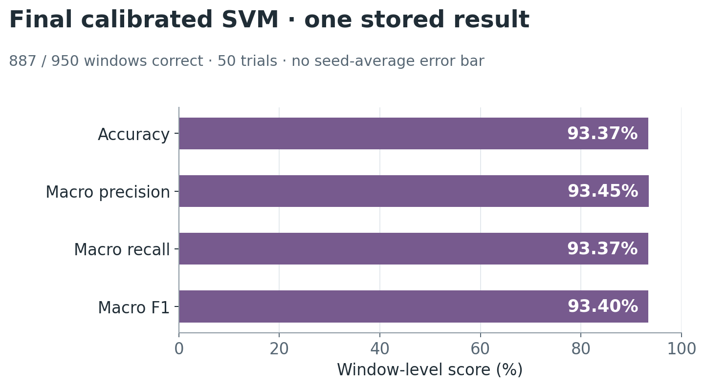

단일 SVM의 네 지표이며 여러 seed의 평균이나 신뢰구간으로 표시하지 않는다.

Hybrid는 검증 단계에서 두 구성 각각 705/760에 대해 711/760을 기록해 사전 기준을 통과했다. 최종 시험 후 비중을 조절한 결과가 아니다. 모든 최종 구성과 개별 seed를 남겼으며, 최고 점수만 보고하지 않는다.

### 6.2 단일 seed 평균과 ensemble을 혼동하지 않는다

| 레시피 | Accuracy 평균 ± SD | Precision 평균 | Recall 평균 | F1 평균 ± SD |
| --- | --- | --- | --- | --- |
| dense_centered | 91.54 ± 0.73 | 91.70 | 91.54 | 91.54 ± 0.72 |
| baseline_reference | 80.84 ± 5.23 | 85.03 | 80.84 | 80.74 ± 5.35 |

개선 DL의 세 seed 시험 평균은 91.54 ± 0.73%이고 확률 ensemble은 93.79%다. 평균 정확도와 확률을 합친 모델의 정확도는 서로 다른 통계량이다.

Fresh baseline은 같은 검증 선택 규칙을 적용해 **18epoch raw**로 동결되었으며 개별 시험 Accuracy가 78.42%, 88.11%, 76.00%로 크게 흔들린다. 이 값은 4절의 **45epoch 원본 DenseNet 88.53%**를 덮어쓰거나 대체하지 않는다. 학습은 서로 다른 실행 환경을 거쳤고 모델별 노출이 같지 않다. 따라서 개선 DL과 이 reference의 +10.70 pp 차이를 centering만의 효과나 완전히 하드웨어를 통제한 개선이라고 해석할 수 없다.

### 6.3 같은 창에서 무엇이 바뀌었는가

| 동일 시험창의 비교 | Accuracy 차이 pp | 조건부 95% 구간 pp | 교정 / 새 오류 |
| --- | --- | --- | --- |
| hybrid_50_50 minus calibrated_SVM | +1.26 | [+0.42, +2.21] | 14 / 2 |
| DL_ensemble minus calibrated_SVM | +0.42 | [-1.47, +2.32] | 44 / 40 |
| DL_ensemble minus baseline_ensemble | +5.58 | [+2.53, +8.84] | 83 / 30 |

구간은 사용자별 층화를 유지하고 **시행 전체 19창을 묶어서** 10,000회 재표집한 조건부 paired bootstrap이다(seed 2026). 학습된 모델을 고정한 기술적 구간이며 모델선택·시험 재사용·실행 환경 차이를 보정하지 않는다. 개별 창 950개를 독립 표본으로 취급한 구간도 아니다.

Hybrid는 SVM이 틀린 14창을 교정하고 맞힌 2창을 새로 틀려 순증 12창이었다. 반면 DL ensemble과 SVM은 교정 44개·새 오류 40개여서 총점이 비슷해도 실패하는 창이 상당히 다르다. 이는 결합의 동기를 설명하지만 독립 일반화 우위의 증명은 아니다.

<a id="errors"></a>
## 7. 누구를 언제 틀리는가

### 7.1 최종 SVM의 오류

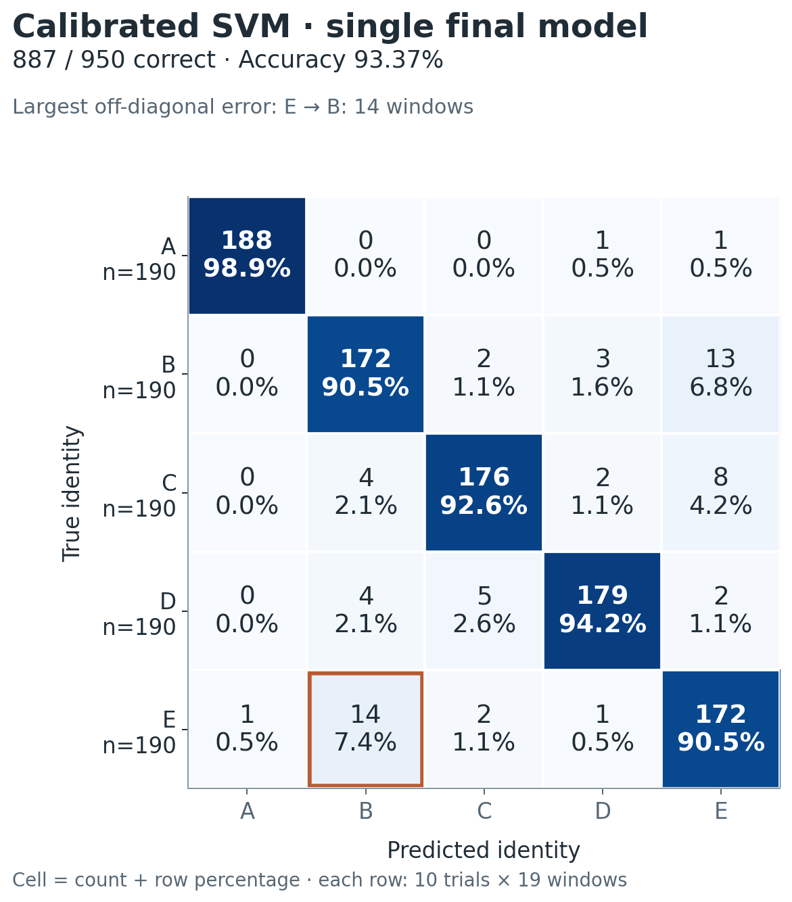

**그림 10.** 행은 실제, 열은 예측이며 각 행의 합은 190이다. 최대 오류 E→B 14개를 표시했다. 전체 63개 오류 중 B↔E가 27개, 약 42.9%다. A는 188/190으로 가장 잘 맞히고 B·E는 각각 172/190이다. 정확도 하나가 가리는 비대칭을 함께 본다.

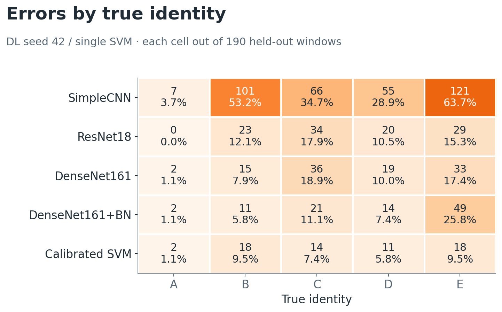

**그림 11.** 공통 시험의 클래스별 오류다. 딥러닝 비교의 혼동행렬은 seed 42 한 번, SVM은 고정 단일 모델이므로 세 seed 평균 혼동행렬이라고 읽지 않는다.

진폭·스펙트럼 모양이 비슷한 사용자 사이에서 혼동이 남을 수 있다는 가설은 타당하지만, 실제 원인으로 확정하지 않는다. 특히 B/E의 차이가 전극 접촉·세션·피부 상태에서 오는지 확인하려면 날짜·전극 재부착을 바꾼 독립 수집이 필요하다. 오류가 적은 A의 성능을 모든 사용자에게 일반화할 수도 없다.

### 7.2 필수 비교군의 혼동행렬과 구체적 실패

| 모델 seed 42 | 최대 오류 | 반대 방향 | 예측 쏠림 |
| --- | --- | --- | --- |
| SimpleCNN | B → C: 52창 | C → B: 35창 | C 예측 256창 / 실제 190창 |
| ResNet18 | E → B: 23창 | B → E: 6창 | B 예측 201창 / 실제 190창 |
| DenseNet161 | E → B: 29창 | B → E: 13창 | B 예측 227창 / 실제 190창 |
| DenseNet161+BN | E → B: 33창 | B → E: 6창 | B 예측 226창 / 실제 190창 |

SimpleCNN은 B→C 52개뿐 아니라 E→D 50개 등 여러 방향으로 크게 혼동한다. 이 양상과 낮은 학습 정확도를 함께 보면 현재 구현에서 표현 또는 최적화가 충분하지 않았을 가능성이 있다. ResNet·DenseNet은 오류 수가 줄지만 E→B 같은 집중된 혼동이 남는다. 원인 가설과 관측 사실을 구분한다.

<details>
<summary><strong>네 딥러닝 모델의 혼동행렬 전체 보기 — 각 그림은 seed 42</strong></summary>

#### SimpleCNN
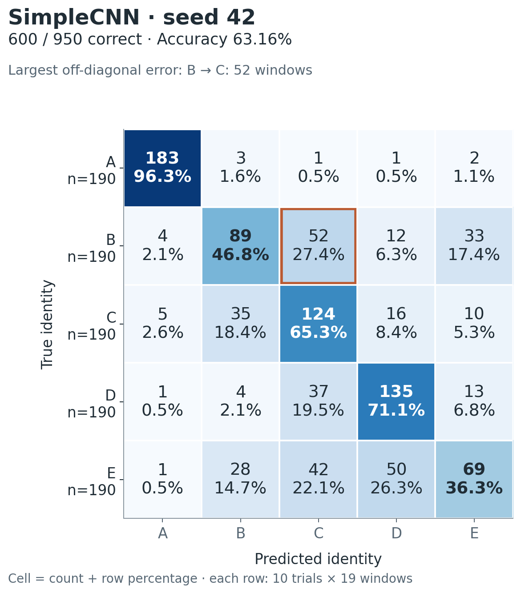

#### ResNet18
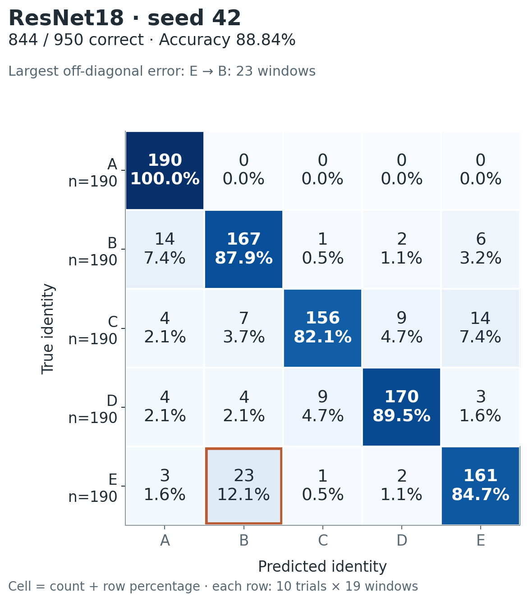

#### DenseNet161
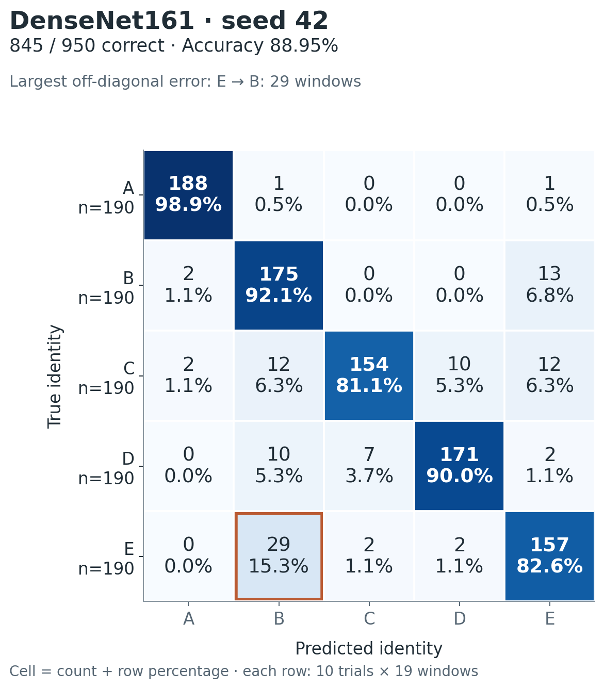

#### DenseNet161 + BN
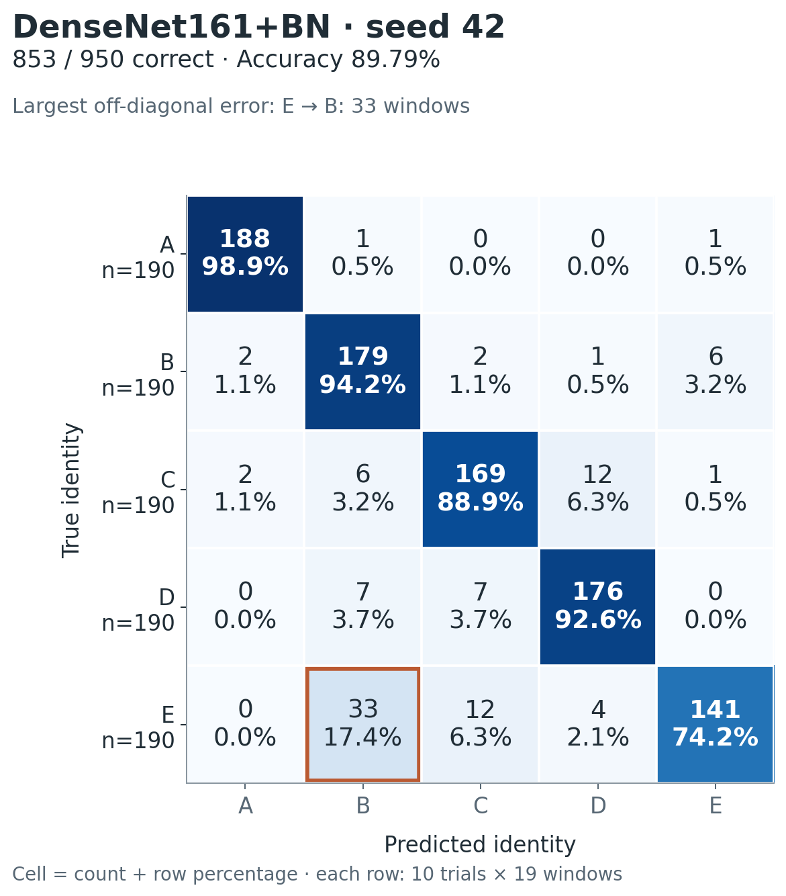

</details>

### 7.3 오류는 창 위치에 따라 달라지는가

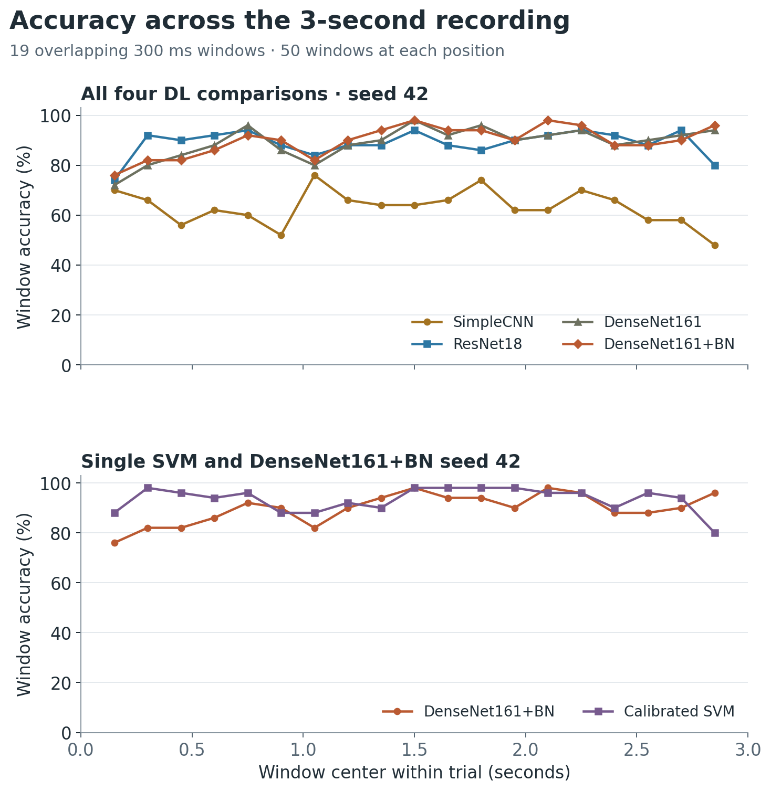

**그림 12.** 창 번호 p의 시작 시각은 `0.15 × p`초이며 폭은 0.3초다. 그림의 x축은 창 중심 시각 `0.15 × p + 0.15`초를 쓴다. 위치별 분모는 50시행이다. 동작 단계별로 점수가 달라져도 특정 구간을 결과를 본 뒤 제외하거나 다시 튜닝하지 않았다. 서로 겹치는 곡선의 점들은 독립적인 19개 실험이 아니다. SVM의 마지막 창(중심 2.85초)은 80%, SimpleCNN은 48%인 반면 BN seed 42는 96%였다. SVM이 평균적으로 좋아도 모든 시간 위치에서 앞서는 것은 아니다.

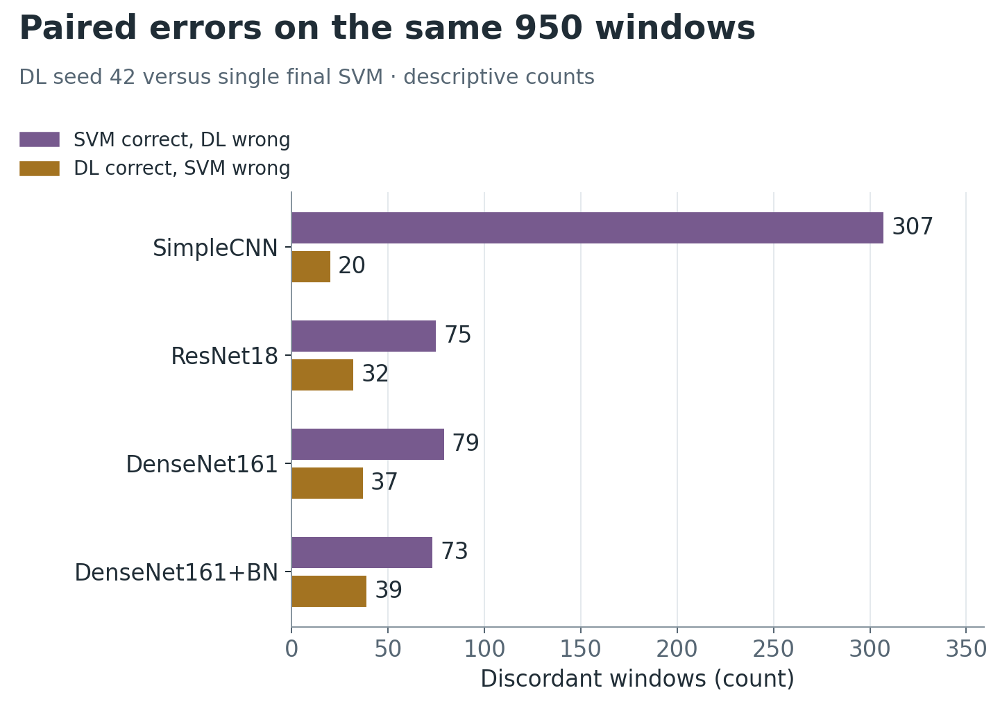

**그림 13.** 같은 시험창의 대응 관계를 보여 준다. 전체 정확도의 작은 차이가 소수 창만 바뀌었다는 뜻은 아니다. 교정과 새 오류가 동시에 생길 수 있으므로 순증만으로 모델 동작을 설명하지 않는다. SVM은 DenseNet+BN seed 42에 대해 73창을 교정하고 39창을 새로 틀려 순증 34창(+3.58 pp)이었고, 둘 다 틀린 창은 24개였다. 원시 신호를 새로 읽지 않고 [저장 예측](sEMG_final/results45/evaluation/)과 [SVM 예측](sEMG_final/svm_final/evidence/final_predictions.csv)에서 계산했다.

<a id="selection"></a>
## 8. 정확도와 비용을 함께 본 최종 선택

### 8.1 수업 비교군의 계산 비용

| 모델 | 학습 파라미터 | 학습 / BN 시간 s | 모델 추론 ms/창 |
| --- | --- | --- | --- |
| SimpleCNN | 19,717 | 405.6 / 0.0 | 1.21 |
| ResNet18 | 11,179,077 | 1539.6 / 0.0 | 25.07 |
| DenseNet161 | 26,483,045 | 9505.8 / 0.0 | 65.01 |
| DenseNet161+BN | 26,483,045 | 9505.8 / 79.3 | 63.65 |

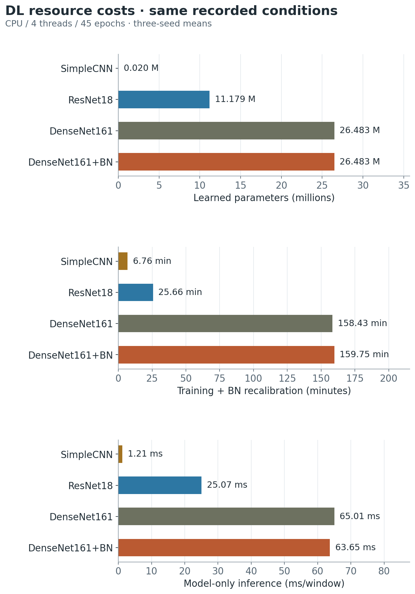

**그림 14.** 원래 CPU 비교의 관측 비용이다. 학습시간은 보존된 epoch의 학습 루프를 포함하고 전처리·검증·저장·중단 후 폐기 계산은 제외한다. BN은 원본 가중치를 공유하므로 전체 학습을 두 번 수행한 것으로 합산하지 않는다. 모델 추론은 전처리된 입력의 batch 1, 예열 10회 뒤 100회 평균이며 기록·필터·CWT 시간은 제외한다.

### 8.2 SVM과 hybrid의 처리 비용

| 구성 | 평균 ms | p50 ms | p95 ms | 19창 전체 처리 ms | 프로세스 RSS MiB |
| --- | --- | --- | --- | --- | --- |
| calibrated_SVM | 2.90 | 2.82 | 3.67 | 15.52 | 117.2 |
| hybrid_50_50 | 218.30 | 210.21 | 266.21 | 1125.60 | 722.2 |

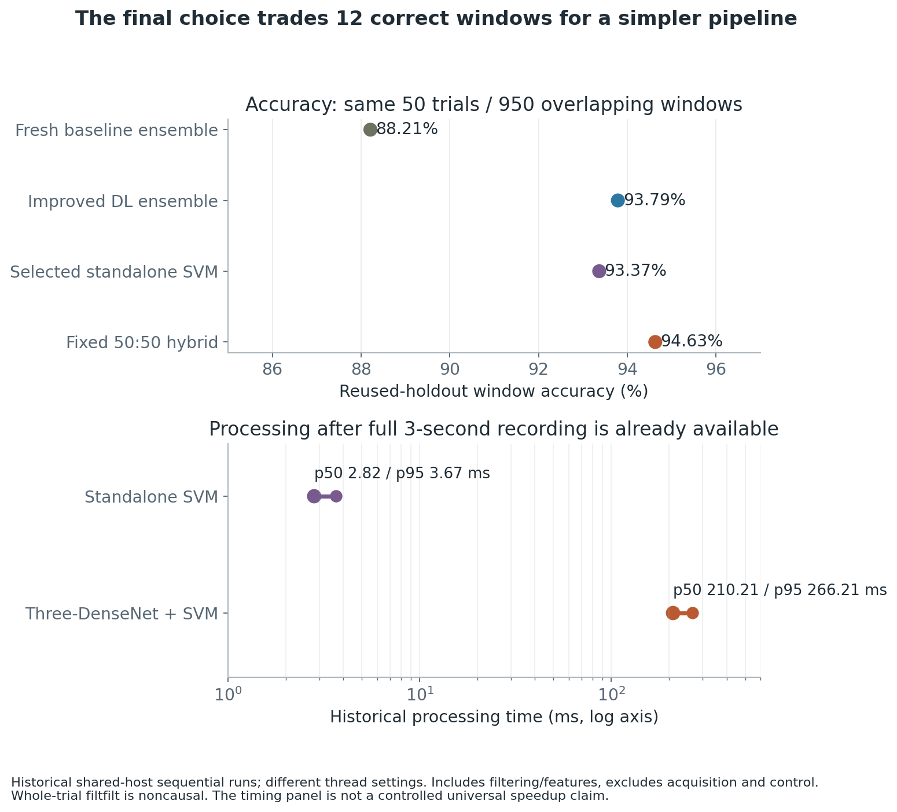

**그림 15.** 같은 시험 결과의 정확도와 별도 보존된 CPU 처리 측정의 범위를 명시했다. 처리 측정은 같은 다섯 검증 신호를 사용했지만 실행은 순차적이고 공유 호스트에서 다른 학습이 진행 중이었다. SVM은 수치 라이브러리 한 thread, hybrid는 PyTorch 네 thread였다. 통제된 보편적 배수 비교가 아니라 당시 구성의 관측 비용이다.

이 표는 **3초 신호가 이미 메모리에 있는 뒤** 시행 전체 필터와 한 창의 특징/CWT·모델 처리를 포함한다. 신호 기록, 네트워크, 문 제어는 제외한다. 두 방법 모두 시행 전체 `filtfilt`를 사용하므로 300 ms 창 입력을 받는다는 이유만으로 300 ms 이내 현장 판정을 보장하지 않는다.

### 8.3 왜 최종 제출은 단독 SVM인가

- 고정 SVM은 887/950 = **93.37%**, hybrid는 899/950 = **94.63%**다. 단독 구성을 택하면서 관측 정확도 1.26 pp, 12창을 포기했다는 사실을 명시한다.
- Hybrid는 세 DenseNet과 SVM을 함께 유지한다. SVM은 39특징과 한 개 SVC·보정기로 구성되며 저장 모델은 약 0.64 MB다. 보존 처리 측정과 구성이 단순한 점을 함께 고려했다.
- SVM의 3초 확률 평균은 50/50이지만, 이를 100% 보안 인증·새 사용자·새 세션 성능으로 주장하지 않는다. 목적이 최고 창 정확도라면 hybrid가 이 결과표의 상위이고, 최소 구성과 설명 가능한 특징 기반 파이프라인을 택한 것이 현재 제출 결정이다.

최종 선택은 [final_selection.json](sEMG_final/final_selection.json)에 별도로 기록했다. 당시의 사전 실험 계획을 사후 선택에 맞춰 다시 쓰지 않았다.

<a id="robustness"></a>
## 9. 재현·외부 데이터·실패한 가설

성공한 최종 점수만으로 결론을 끝내지 않았다. 아래 실험은 왜 현재 주장의 범위를 좁혀야 하는지 보여 준다. 원래 PALM 시험 93.37%와 다른 표본·환경을 한 순위표로 합치지 않는다.

### 9.1 동일 가중치의 수치 일치와 새 학습의 재현은 다르다

PALM의 고정 40epoch GPU 재학습은 개발 검증에서 Accuracy **89.6491 ± 0.4230%**, 역사적 CPU 고정 40epoch 값은 **90.3947 ± 0.8628%**였다(세 seed, 여기의 ±는 **표본 SD**). CPU와 GPU의 실행 라이브러리 버전도 달랐다.

보존 가중치의 CPU/GPU 추론 parity 확인이 통과해도, 새 학습의 정확도가 같은 것은 아니다. 버전, 수치 연산과 CPU/CUDA의 RNG·dropout 동작이 함께 달라지므로 위 차이를 GPU 자체의 인과 효과로 해석하지 않는다. [GPU arm별 집계](#robustness), [검증 범위](#additional-evidence)에 이를 분리했다.

GPU 원 예측 CSV는 현재 묶음에 없어서, 이번 문서 작업은 당시의 집계·혼동행렬·parity 검증 기록을 확인했다. 원 예측을 다시 추론하거나 확률 수준 검증을 새로 수행했다고 주장하지 않는다.

### 9.2 늦은 epoch 평균은 사전 승격 기준을 통과하지 못했다

Raw40 평균은 89.6491%, 학습 데이터만 이용한 BN 대조는 90.4825%, epoch 36–40 파라미터 평균+BN은 90.2632%였다. 평균 모델이 raw40보다 높아 보이더라도 **동일 BN 대조보다 낮으므로** 이를 파라미터 평균의 이득으로 설명할 수 없다.

사전 승격 기준은 두 대조 모두에 대한 최소 개선·macro F1·paired seed 조건이었다. 조건을 통과하지 못해 raw40을 유지했다. 평균 구간이나 승격 문턱을 결과에 맞춰 바꾸지 않았다. [GPU 대조 결과](#robustness)에 실패한 결과도 남겼다.

### 9.3 다른 날짜의 데이터에서는 높은 PALM 점수가 유지되지 않았다

별도 GRABMyo pilot은 참가자 1–5, Hand Close 동작, F1/F5 채널, day 1 학습·day 2 진단·day 3 시험이다. 한 시행은 5초·32창이고 2,048 Hz를 1,000 Hz로 재표본화했다. 하루 35시행·1,120창이며, **그 데이터에서 새로 학습한 모델의 cross-day 실험**이다. PALM 모델을 그대로 넣은 zero-shot 전이 결과가 아니다.

| 별도 GRABMyo 모델 | 정답 / 1,120창 | 창 Accuracy | 창 macro F1 | 정답 / 35시행 |
| --- | --- | --- | --- | --- |
| baseline_ensemble | 611 | 54.55 | 53.63 | 26 |
| improved_ensemble | 688 | 61.43 | 60.93 | 28 |
| SVM | 635 | 56.70 | 57.10 | 26 |
| hybrid | 698 | 62.32 | 62.50 | 30 |

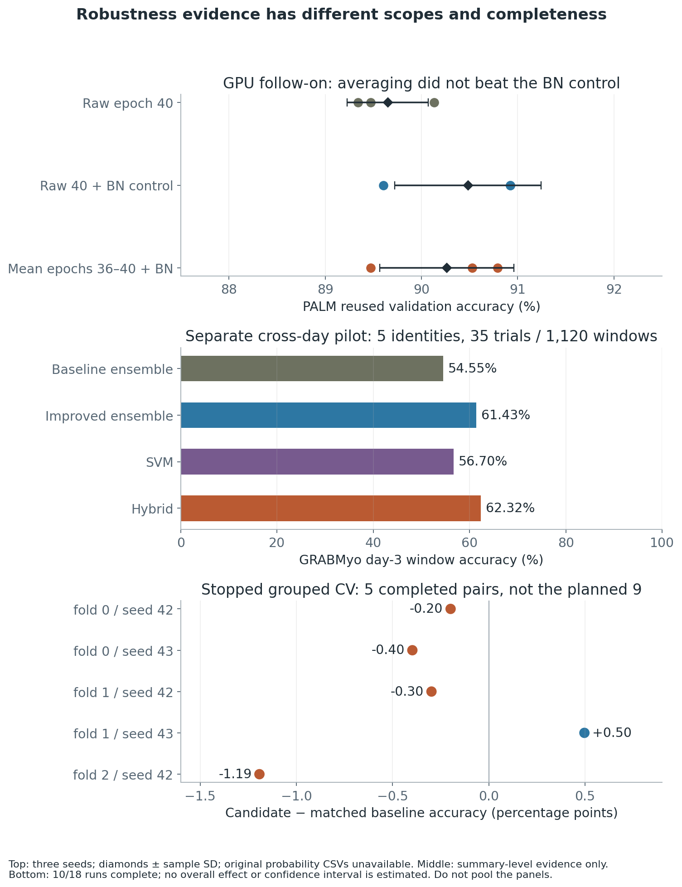

**그림 16.** 데이터셋과 평가 범위를 분리해 보여 준다. GRABMyo의 SVM 56.70%, hybrid 62.32%는 PALM 안의 높은 점수가 날짜·측정 환경에 일반화된다는 근거가 아님을 보여 준다. 다만 데이터셋·동작·채널·시행 조건이 동시에 달라지므로 감소량을 ‘날짜 효과’ 하나로 분해하지 않는다.

GRABMyo 원 예측 CSV와 결과 ZIP은 현재 자료에 없어 정답 수의 산술과 저장된 구조화 요약만 확인했다. macro F1과 ensemble 확률 일치 검사는 당시 기록 수준이며 이번에 독립 재검산하지 못했다. [외부 평가 집계](#robustness)과 [증거 수준](#additional-evidence)을 명시했다.

### 9.4 좋은 재사용 검증 점수만으로 후속 변경을 확정하지 않았다

후속 weight decay 1e-3 후보는 같은 40시행을 재사용한 세 seed 평균에서 **90.7456 ± 0.5318%**였다(표본 SD). 탐색 규칙을 통과했지만 독립 검증의 개선은 아니다. Dropout 0 후보는 seed 42만 완료되어 세 seed 결론을 낼 수 없다.

이를 더 확인하려던 matched grouped CV는 원래 159 학습 시행 안의 3fold × 3seed × 2arm = 18회 계획이었다. **10회·5쌍만 완료했고 열한 번째는 7epoch에서 중단**, 이후 실행은 취소되었다. 완료한 다섯 쌍에서는 네 쌍이 낮아지고 한 쌍만 높아졌다. 계획이 미완료라 전체 평균 효과·신뢰구간·최종 승격을 만들지 않는다. 이 미완료 DL CV를 5.4절의 완료된 SVM 5-fold와 혼동하지 않는다.

[완료·중단 상태 설명](#robustness) · [완료 쌍의 차이 그림](#robustness) · [추가 실험의 공개 검증 범위](#additional-evidence)

새 SVM C/gamma 탐색은 시작되지 않았다. 이 보고서의 93.37%는 그 미실행 계획에서 나온 새 성능이 아니다.

<a id="reproduce"></a>
## 10. 공개 코드의 검증과 재현

이 저장소의 기존 코드·예측 파일은 보존했다. **필수 45epoch 비교와 최종 SVM은 공개 예측에서 재검산**할 수 있다. 추가 실험은 본문에 정리한 집계와 그래프 수준으로 공개하며, 별도 실행 원본이나 개별 시행 자료까지 새로 공개한 것은 아니다.

### 10.1 기존 공개 결과 확인

저장소를 받은 뒤 `sEMG_final/`에서 실행한다. Python 3.12와 NumPy 2.3.5, SciPy 1.17.0, scikit-learn 1.8.0, joblib 1.5.3, matplotlib 3.10.8을 사용한다. 아래 검산은 모델 학습이나 원시 신호 재평가를 수행하지 않는다.

```bash
git clone https://github.com/KyunghoCha/semg-auth-coursework.git
cd semg-auth-coursework/sEMG_final
python -m pip install -r svm_final/requirements.txt
python -m pip install matplotlib==3.10.8
python -m unittest -v test_summary45.py
python svm_final/audit.py
cd svm_final
python -m unittest -v test_audit.py
```

- [기존 딥러닝 실행·재평가·요약 PDF 생성](sEMG_final/README.md)
- [고정 SVM 레시피·데이터 준비·CV·학습·재사용 시험 재현](sEMG_final/svm_final/README.md)
- [기준선 저장 예측 검증 코드](sEMG_final/summarize45.py)
- [SVM 저장 예측·확률·분할·CV 검증 코드](sEMG_final/svm_final/audit.py)

재학습은 공개 데이터를 고정 commit으로 별도 준비해야 하며 실제 학습 명령은 각 실행 안내에 있다. 기록된 성능에 맞추기 위한 재튜닝은 재현으로 간주하지 않는다. 같은 seed라도 실행 버전·장치가 달라지면 학습 결과가 달라질 수 있다.

### 10.2 과제의 핵심 파일

| 공개 경로 | 역할 |
|---|---|
| [README.md](README.md) | 현재 종합 보고서 전체. 이 파일 자체가 편집 가능한 보고서 원본 |
| [data_utils.py](sEMG_final/data_utils.py) | CSV 검증·정확 중복 제거·시행 단위 분할 |
| [experiment.py](sEMG_final/experiment.py) | 수업 기준 전처리·CWT·세 모델의 공통 함수 |
| [results45/](sEMG_final/results45/) | 필수 45epoch 계획·설정·학습 이력·예측·지표 |
| [svm_final/](sEMG_final/svm_final/) | 최종 단일 SVM 코드와 기존 공개 검증 근거 |
| [docs/figures/](docs/figures/) | 이 보고서에서 직접 읽는 그래프 19개 |
| [과제 요약 PDF](sEMG_final/results45/summary/report.pdf) | 필수 항목과 최종 SVM을 담은 4쪽 요약 |

분할 seed는42, 원래 딥러닝 학습 seed는42/43/44, DenseNet CV는43–47, SVM 보정 fold seed는2026이다. 추가 실험의 재사용 검증·선택 후 CV·외부 데이터·미완료 실행을 기존의 완결된 공개 검산 범위와 혼동하지 않는다. 본문에서 새 학습을 수행했다고 주장하지 않으며, 그래프에 없는 원자료까지 검증 가능하다고 약속하지 않는다.

<a id="limits"></a>
## 11. 한계와 다음 검증

1. **시험 재사용과 선택 편향.** 최종 50시행은 이전 과제에서 결과를 이미 확인했다. 40시행 개발 검증도 여러 선택에 사용했으며, 이후의 5-fold가 탐색 전체의 낙관 편향을 제거하지 않는다. 다음 판단에는 별도 수집한 독립 시험이 필요하다.
2. **창의 종속성.** 한 시행의 19개 창은 절반씩 겹치며 같은 사용자·동작 조건을 공유한다. 950창을 950개의 독립 시행으로 취급하지 않았고, uncertainty는 시행을 묶어 계산한다.
3. **5명·단일 세션의 closed-set.** 등록 인원이 적고 알려진 사용자끼리만 구분했다. 미등록자 거절, FAR·FRR·EER, 장기간 재부착이나 실제 문 환경의 안정성은 이 데이터에서 검증하지 않았다.
4. **진폭 단서의 양면성.** 진폭과 모양을 결합한 특징은 현재 분할에서 좋았지만 세션·전극 접촉을 함께 학습했을 가능성이 있다. 같은 사람을 여러 날짜·장치·전극 위치에서 측정하는 대조가 필요하다.
5. **실시간성과 비용.** 시행 전체 `filtfilt`는 미래 구간을 사용하는 비인과 처리다. 현재의 300 ms 입력·model-only ms 수치를 실시간 출입 제어 지연으로 환산할 수 없고, causal streaming 구현을 별도로 평가해야 한다.
6. **실행 환경과 불완전한 증거.** CPU 추가 학습에는 서로 다른 프로세서 이력이 있고 GPU 재학습은 PyTorch 버전도 달랐다. 일부 GPU·외부 결과는 원 예측이 없어 요약 수준 검증만 가능하며, 미완료 CV는 전체 효과를 보고하지 않는다.
7. **원논문과의 관계.** 수업 기준 구현과 논문의 전처리·분할·세부 구조가 완전히 같다고 확인할 수 없다. SVM이나 hybrid가 논문 숫자와 비슷하거나 높더라도 DenseNet 논문 94%의 정확한 재현으로 이름 붙이지 않는다.

**현재 결론:** 필수 딥러닝 비교를 보존하면서, 최종 제출은 39특징 보정 SVM 단독 93.37%로 정리했다. 더 높은 hybrid 94.63%와 비용 차이를 공개했고, 이를 새로운 독립 일반화 성능으로 과장하지 않았다. 다음 우선순위는 같은 시험을 더 튜닝하는 것이 아니라, 독립 세션과 실제 운영 조건에서 선택이 유지되는지 확인하는 것이다.

<a id="references"></a>
## 12. 출처와 이전 제출 자료

- Shin, Y., Kim, J. & Choi, S.-I. (2026). *Palm sEMG-based user identification during doorknob rotation using a convolutional neural network.* Scientific Reports 16, 22244. [논문 DOI](https://doi.org/10.1038/s41598-026-46294-3)
- [공개 PALM 데이터](https://github.com/sea3551/palm-sEMG-doorknob-filtered), Data © 2025 Yeonjung Shin, [CC BY 4.0](https://creativecommons.org/licenses/by/4.0/). 고정 commit은 2절에 명시했다.
- 수업 코드 구성은 Step 1 2·3주차 강의 예제를 기반으로 한다. 원 강의 PDF와 논문 PDF는 재배포하지 않는다.
- [PyTorch 재현성 안내](https://docs.pytorch.org/docs/2.8/notes/randomness.html), [PyWavelets CWT](https://pywavelets.readthedocs.io/en/latest/ref/cwt.html), [scikit-learn 확률 보정](https://scikit-learn.org/stable/modules/calibration.html)
- 구성의 충실도를 점검할 때 [공개 수업 예시 저장소](https://github.com/Oseojin/DCU_DeepLearningProgramming_SEMG/tree/cb8aa254388389c841c1dc83ce67e3828f985894)를 참고했다. 그 저장소의 모델 성능·실험 수치·그래프를 본 실험의 결과로 가져오지 않았으며 평가 조건이 달라 숫자 순위로 비교하지 않는다.

**생성형 AI 사용:** 코드 작성, 실험 실행 지원, 복구·검증, 결과 재계산, 시각화와 문서 정리에 활용했다. 이 README의 수치는 저장된 실제 실험 근거에서 계산했으며, 이번 문서 개편 과정에서 새로운 학습 결과를 만들지 않았다. 검증 가능한 원자료 경로와 확인하지 못한 범위를 함께 기록한다.

[1주차 설명과 원래 제출물](docs/archive/README.md) · [1주차 노트북](week1_report.ipynb) · [1주차 PDF](submission/week1_report.pdf) · [필수 과제 요약 PDF](sEMG_final/results45/summary/report.pdf)

---

이 README 자체가 현재 종합 보고서다. 기존 공개 예측의 검산 방법과 추가 실험의 공개 범위는 [10절](#reproduce)에 명시했다.
